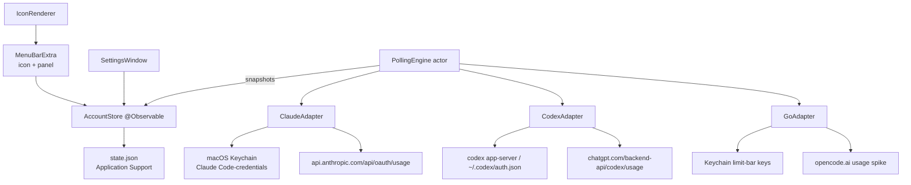

# Menu Bar Limits Design

**Spec**: `.specs/features/menu-bar-limits/spec.md`
**Context**: `.specs/features/menu-bar-limits/context.md`
**Status**: Draft

---

## Architecture Overview

Native macOS 14+ app built with SwiftUI `MenuBarExtra` (window style). All state lives in an `@Observable` `AccountStore` published to both the menu bar icon label and the panel. Provider access is isolated behind a `ProviderAdapter` protocol implemented by three adapters (Claude Code, Codex, OpenCode Go); a `PollingEngine` actor schedules per-account refreshes with 429 backoff and wake-from-sleep handling. Secrets never touch disk files: Claude/Codex credentials stay where their CLIs put them (Keychain / `~/.codex`), Go API keys go to the app's own Keychain items. Non-secret state persists as JSON in Application Support.



---

## Code Reuse Analysis

### Existing Components to Leverage

None - fresh scaffold (only `.gitignore`, `README.md`, AGENTS.md exist).

### Integration Points

| System | Integration Method |
| --- | --- |
| macOS Keychain (`Claude Code-credentials`) | SecItemCopyMatching generic-password read (triggers one-time user authorization prompt) |
| Codex CLI | Preferred: spawn `codex app-server --stdio`, JSON-RPC `account/rateLimits/read`; fallback: read `$CODEX_HOME/auth.json` + GET `chatgpt.com/backend-api/codex/usage` |
| OpenCode Go | Spike probes candidate endpoints with stored API key; all-fail ⇒ `.unsupported` state |
| SMAppService | Launch-at-login registration |

**Research findings locked into design:** Anthropic OAuth usage endpoint returns `five_hour`/`seven_day` utilization + `resets_at` (header `anthropic-beta: oauth-2025-04-20`) but rate-limits aggressively; Codex windows carry `used_percent`, `limit_window_seconds`, resets; OpenCode Go has **no public usage API today** (upstream issues #10448/#18648) - hence the bounded spike + explicit unsupported state.

---

## Components

### LimitBarApp
- **Purpose**: App entry point; owns `MenuBarExtra` scene (icon label + window-style panel) and Settings scene.
- **Location**: `Sources/LimitBar/App/LimitBarApp.swift`
- **Interfaces**: `@main struct LimitBarApp: Scene`; binds `MenuBarExtra` label to `IconRenderer.image`.
- **Dependencies**: AccountStore, IconRenderer.
- **Reuses**: nothing (greenfield).

### AccountStore
- **Purpose**: Single source of truth - accounts, snapshots, active account ID, poll interval; persists non-secret state.
- **Location**: `Sources/LimitBar/Core/AccountStore.swift`
- **Interfaces**:
  - `accounts: [Account]`, `snapshot(for: Account.ID) -> AccountSnapshot?`
  - `activeAccountID: Account.ID?` (persisted)
  - `func apply(_ result: FetchResult, for: Account.ID)` (MainActor)
  - `func add/remove/update(account:)`
- **Dependencies**: PersistenceController.
- **Reuses**: Swift Observation framework.

### ProviderAdapter (protocol) + 3 implementations
- **Purpose**: Translate each provider's storage/API into `[LimitWindow]`; isolate undocumented-endpoint risk.
- **Location**: `Sources/LimitBar/Providers/ClaudeAdapter.swift`, `CodexAdapter.swift`, `GoAdapter.swift`
- **Interfaces**:
  ```swift
  protocol ProviderAdapter: Sendable {
      func fetchUsage(for account: Account) async throws -> [LimitWindow]
  }
  enum ProviderError: Error { case missingCredentials, unauthorized, rateLimited(retryAfter: TimeInterval?), network(URLError), parseFailed, unsupported }
  ```
- **Dependencies**: URLSession, KeychainStore, Process (Codex app-server).
- **Reuses**: none.

### PollingEngine
- **Purpose**: Per-account scheduled refresh with backoff state machine, manual-refresh reset, sleep-wake catch-up.
- **Location**: `Sources/LimitBar/Core/PollingEngine.swift`
- **Interfaces**:
  - `actor PollingEngine`; `func start(store:)`, `func refreshAllNow() async`, `func intervalChanged()`
  - Backoff: on `.rateLimited`, next delay = current × 2, capped at 30 min; success/manual refresh restores base interval.
  - Observes `NSWorkspace.didWakeNotification` → refresh accounts older than their interval.
- **Dependencies**: ProviderAdapters, AccountStore, NSWorkspace notifications.
- **Reuses**: structured concurrency (Task.sleep loops).

### PersistenceController
- **Purpose**: Load/save `AppState` JSON (accounts, snapshots cache, prefs) at `~/Library/Application Support/limit-bar/state.json`; atomic writes via FileManager replace.
- **Location**: `Sources/LimitBar/Core/PersistenceController.swift`
- **Interfaces**: `func load() -> AppState?`, `func save(_ AppState)`; never stores secrets.
- **Dependencies**: Foundation only.

### KeychainStore
- **Purpose**: CRUD of app-owned secrets (OpenCode Go API keys) under service `limit-bar`.
- **Location**: `Sources/LimitBar/Core/KeychainStore.swift`
- **Interfaces**: `func set(_:for:)/get(for:)/delete(for:)` wrapping SecItem APIs; maps errAuthDenied to `.missingCredentials`.
- **Dependencies**: Security framework.

### IconRenderer
- **Purpose**: Draw status-item image from active snapshot: progress bar tinted green <70% / amber 70–89% / red ≥90%; countdown text when a window is at 100%; neutral gray when no data; optional % text.
- **Location**: `Sources/LimitBar/UI/IconRenderer.swift`
- **Interfaces**: `static func image(for snapshot: AccountSnapshot?, window: WindowKind) -> NSImage`.
- **Dependencies**: AppKit drawing.
- **Reuses**: template-image conventions for menu bar.

### PanelView
- **Purpose**: Compact panel - segmented tabs (one per account labeled), one `LimitBarRow` per plan window (% used, absolute value when present, reset countdown), staleness footer ("updated Xm ago"), refresh button, empty/setup/error states per LIM-07…13.
- **Location**: `Sources/LimitBar/UI/PanelView.swift`
- **Dependencies**: AccountStore.
- **Reuses**: SwiftUI ProgressView/Gauge styling.

### SettingsWindow
- **Purpose**: Accounts management (add/remove/rename, provider picker, optional CODEX_HOME override for extra Codex accounts, SecureField for Go key), displayed-window picker per account, interval field validated 60–3600 s, launch-at-login toggle.
- **Location**: `Sources/LimitBar/UI/SettingsView.swift`
- **Dependencies**: AccountStore, KeychainStore, LaunchAtLoginController.

### LaunchAtLoginController
- **Purpose**: Register/unregister `SMAppService.mainApp`; reflects current status.
- **Location**: `Sources/LimitBar/Core/LaunchAtLoginController.swift`

---

## Data Models

```swift
enum ProviderKind: String, Codable, Sendable { case claudeCode, codex, openCodeGo }
enum WindowKind: String, Codable, Sendable { case fiveHour, weekly, monthly }

struct Account: Identifiable, Codable, Sendable {
    var id: UUID
    var provider: ProviderKind
    var label: String                  // tab title; unique per user editing
    var displayedWindow: WindowKind    // drives menu bar icon (default .fiveHour)
    var codexHomeOverride: String?     // multi-account Codex via separate CODEX_HOME
}

struct LimitWindow: Codable, Equatable, Sendable {
    let kind: WindowKind
    var usedPercent: Double            // 0...100
    var usedAbsolute: String?          // "$8.40" when provider reports it
    var resetsAt: Date?
}

enum SnapshotState: Codable, Sendable {
    case fresh, stale
    case error(String)                 // network/parse message
    case unauthorized                  // 401/403 → show CLI re-login instructions
    case unsupported                   // OpenCode Go until endpoint exists
}

struct AccountSnapshot: Codable, Sendable {
    var windows: [LimitWindow]
    var fetchedAt: Date?
    var state: SnapshotState
}

struct AppState: Codable, Sendable {
    var accounts: [Account]
    var snapshots: [UUID: AccountSnapshot]   // last-good cache across launches
    var activeAccountID: UUID?
    var pollInterval: TimeInterval           // default 300, clamp 60...3600
}
```

**Relationships**: `AppState` aggregates `Account` 1—N→ `AccountSnapshot`; `LimitWindow` belongs to exactly one snapshot; secrets referenced by `Account.id` live only in Keychain.

---

## Error Handling Strategy

| Error Scenario | Handling | User Impact |
| --- | --- | --- |
| HTTP 429 from provider | Adapter throws `.rateLimited`; engine doubles delay (cap 30 min); data stays | Last values remain visible; staleness marker appears after >1 missed cycle |
| 401/403 or expired OAuth token | `.unauthorized` snapshot state | Tab shows "run `claude login` / re-auth via CLI" instructions |
| No credential found (Keychain item absent / auth.json missing / key unset) | `.missingCredentials` | Tab shows provider-specific setup steps (LIM-13) |
| Network error / timeout / 5xx | `.error(String)` + keep cache | Cached bars + "updated Xm ago" footer |
| Unparseable response (format drift) | `.parseFailed` logged locally, cached data kept | Same stale presentation; no crash |
| Keychain access denied by user | Mapped to `.missingCredentials` + error note | Tab explains granting access in System Settings |
| Zero accounts configured | Empty state in panel | "Add your first account" button opens Settings |
| Go endpoint probe fails (all candidates) | `.unsupported` | Tab: "OpenCode Go usage API not available yet" |

---

## Risks & Concerns

| Concern | Location (file:line) | Impact | Mitigation |
| ------- | -------------------- | ------ | ---------- |
| Undocumented/unofficial endpoints may change or throttle (Claude oauth usage, ChatGPT backend-api, Go spike) | Provider adapters | Indicators break silently at worst | Adapters isolated behind protocol; parse/network failures degrade to stale/error; conservative 300 s polling + backoff; spike bounded to candidate list, then explicit `.unsupported` |
| Reading another app's Keychain item triggers authorization prompt and can be denied | ClaudeAdapter | First-run friction | Onboarding copy in tab explains the prompt; denial maps to actionable error state |
| Claude OAuth token expiry is managed by Claude Code CLI, not by us | ClaudeAdapter | Token expires if CLI unused for long | v1 does not refresh tokens; `.unauthorized` instructs one CLI re-login (documented limitation) |
| Multi-account Codex requires user-managed duplicate `CODEX_HOME`s | CodexAdapter, SettingsWindow | Confusing setup for second account | Optional advanced field per account + docs snippet showing `CODEX_HOME=~/codex-work codex login` |
| `MenuBarExtra(.window)` has known sizing/focus quirks | PanelView | Panel may clip or mis-dismiss on some macOS builds | Fixed compact frame; if blocking, fallback to NSStatusItem+NSPopover is contained inside `LimitBarApp` + `PanelView` (AD-001 names it) |
| Fresh scaffold: no test infrastructure yet | repo root | Gates have nowhere to run | Tasks phase creates Package.swift + Swift Testing targets before first implementation task |

---

## Tech Decisions (only non-obvious ones)

| Decision | Choice | Rationale |
| --- | --- | --- |
| UI architecture | SwiftUI `MenuBarExtra` (macOS 14+), fallback NSStatusItem+NSPopover | Native dismissal/anchoring for free; zero dependencies; AppKit fallback named in case of platform quirks |
| Project generation | xcodegen `project.yml` committed; generated `.xcodeproj` git-ignored | Diffable build config; regenerable by agents; tests run via `xcodebuild test` |
| Concurrency shape | Actors for engine/adapters; `@Observable` store on MainActor | Data-race safety by construction; matches Swift 6 strict concurrency |
| Persistence | Single JSON file in Application Support (not UserDefaults) | Snapshot cache is structured/nested; atomic writes; easy to inspect/reset |
| Tests | Swift Testing (`swift-testing-pro` skill conventions) | Modern native framework |
| Third-party dependencies | None | Every need covered by system frameworks; supply-chain surface kept empty |

> Project-level decisions recorded as AD-001…AD-005 in `.specs/STATE.md` Decisions log.
