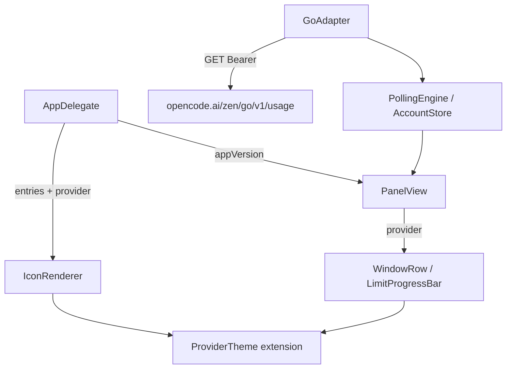

# Provider Identity Design

**Spec**: `.specs/features/provider-identity/spec.md`
**Status**: Draft

---

## Architecture Overview

Three independent changes layered onto the existing `NSStatusItem` + `NSPopover` architecture (AD-001 fallback path). A single new source of truth — `ProviderKind` theme extension — feeds both rendering surfaces (popover bars via SwiftUI, menu bar icon via AppKit). The OpenCode spike adapter is reworked in place to call the official quota endpoint with proper HTTP error mapping; polling, backoff, persistence, and the `ProviderAdapter` protocol are untouched (AD-003/004/005 conform). The version label is read once from `Bundle.main` in `AppDelegate` and injected into `PanelView`, following the repo's dependency-injection style.



### Approach considered and rejected

- **Replace `Style.Tint` with raw `NSColor`**: rejected — the semantic enum keeps tests expressive (`tint == .provider(.codex)`), drives `isTemplate` cleanly, and avoids system-color identity-comparison pitfalls.
- **Keep the candidate-URL probe loop, adding the official URL first**: rejected — the loop collapses every non-200 into "keep probing", which cannot deliver the required 401/403/429 error mapping (PID-12).
- **Read `Bundle.main` inside `PanelView`**: rejected — repo pattern injects dependencies; injection keeps the view preview/test friendly.

---

## Code Reuse Analysis

### Existing Components to Leverage

| Component | Location | How to Use |
| -------------------- | ------------------- | ------------------------- |
| `LimitProgressBar` | `Sources/LimitBar/UI/PanelView.swift:203` | Unchanged; receives provider tint from `WindowRow` |
| `IconRenderer.style/image` | `Sources/LimitBar/UI/IconRenderer.swift:20,55` | Extend signature with provider; keep neutral/template logic |
| `GoAdapter.readKey/apiKey` | `Sources/LimitBar/Providers/GoAdapter.swift:70-80` | Keychain key resolution reused verbatim |
| `TestSupport.stubbedSession` | `Tests/LimitBarTests/TestSupport.swift` | URLProtocol stubbing for new GoAdapter tests |
| `BackoffPolicy`/`PollingEngine` | `Sources/LimitBar/Core/PollingEngine.swift` | Unchanged; consumes new `ProviderError` cases as today |
| VERSION→`MARKETING_VERSION` chain | `scripts/build.sh:23-24,46,61`, `project.yml:32-33`, `Info.plist:21-22` | Version label reads `CFBundleShortVersionString` at runtime; no build changes |

### Integration Points

| System | Integration Method |
| -------------- | ------------------ |
| OpenCode Go quota API | `GET https://opencode.ai/zen/go/v1/usage`, `Authorization: Bearer <key>`; envelope `usage.{rolling,weekly,monthly}` with `status`/`percent` (maintainer-confirmed in anomalyco/opencode#43983; shape per cc-switch#6433) |
| Persisted `AppState` | No schema change; `ProviderKind.openCodeGo` rawValue and `SnapshotState.unsupported` case retained |
| Localization | Changed English source keys updated in all three `.lproj` tables (AGENTS.md rule) |

---

## Components

### ProviderTheme (new)

- **Purpose**: Single source of truth for per-provider accent colors on both rendering surfaces.
- **Location**: `Sources/LimitBar/UI/ProviderTheme.swift`
- **Interfaces**:
  - `ProviderKind.barNSColor: NSColor` — sRGB components: claudeCode `#FF8C00` (255,140,0), codex `#4169E1` (65,105,225), openCodeGo `#C0C0C0` (192,192,192), all alpha 1
  - `ProviderKind.barColor: Color` — SwiftUI bridge (`Color(nsColor:)`)
- **Dependencies**: SwiftUI/AppKit only
- **Reuses**: nothing; leaf utility

### IconRenderer (modified)

- **Purpose**: Menu bar image; tint becomes provider-driven instead of usage-driven.
- **Location**: `Sources/LimitBar/UI/IconRenderer.swift`
- **Interfaces**:
  - `Style.Tint` gains `case provider(ProviderKind)` (keeps `.neutral`; drops `.green/.amber/.red`)
  - `style(for:window:provider:now:)` — new `provider` parameter; usage thresholds removed; 100%-full countdown branch keeps behavior with `tint = .provider(kind)`
  - `image(for entries: [(label, snapshot, window, provider)], now:)` — entries carry provider
  - `color(for:)` maps `.provider(kind)` → `kind.barNSColor`, `.neutral` → `.tertiaryLabelColor`
- **Dependencies**: ProviderTheme, AppKit
- **Reuses**: existing bar drawing, countdown formatting, template rule (all-neutral only)
- **Removals**: `amberThreshold`/`redThreshold` constants (last consumer is `WindowRow`, also changing)

### PanelView (modified)

- **Purpose**: Popover content; provider-colored rows + version label.
- **Location**: `Sources/LimitBar/UI/PanelView.swift`
- **Interfaces**:
  - `PanelView.store:onRefresh:onOpenSettings:appVersion:` — new optional `appVersion: String?`
  - `WindowRow` gains `provider: ProviderKind`; `tint` becomes `provider.barColor` (threshold logic deleted)
  - `tabs` layout: `HStack(spacing: 8) { ScrollView(tabs); versionLabel }` so the label never overlaps scrolling pills
  - `emptyState` gains `.overlay(alignment: .topTrailing) { versionLabel }`
  - `versionLabel`: `Text("v\(appVersion)")`, ~12 pt `.secondary` `.monospacedDigit()`, hidden when `appVersion` nil
- **Dependencies**: AccountStore, ProviderTheme
- **Reuses**: all existing row/footer/unsupported/reauth structures

### GoAdapter (reworked)

- **Purpose**: Fetch real OpenCode Go quota windows from the official endpoint.
- **Location**: `Sources/LimitBar/Providers/GoAdapter.swift`
- **Interfaces**:
  - `static let usageURL = URL(string: "https://opencode.ai/zen/go/v1/usage")!` (replaces `candidateURLs`; `dollarCaps`/`periodKeys` removed)
  - `fetchUsage(for:)` — read key (unchanged), single GET with Bearer; 200→parse, 401/403→`.unauthorized`, 429→`.rateLimited(Retry-After)`, other non-200/transport→`.network`; no longer throws `.unsupported`
  - `static func parse(_ data: Data) throws -> [LimitWindow]` — root `usage` object; key map `rolling→.fiveHour`, `weekly→.weekly`, `monthly→.monthly`; `percent` accepted as Int or Double; clamped to 0...100; optional reset-timestamp field mapped to `resetsAt` (nil when absent/unparsable); zero windows → `.parseFailed`
- **Dependencies**: `CredentialStore`, `URLSession` (injected, unchanged)
- **Reuses**: `readKey`/`apiKey`, `TestSupport.stubbedSession` in tests

### App wiring (modified)

- **Purpose**: Feed provider into icon entries; inject app version into the panel.
- **Location**: `Sources/LimitBar/App/LimitBarApp.swift`
- **Interfaces**:
  - `AppDelegate.redrawIcon()` — entries gain `provider: account.provider`
  - `AppDelegate` computes `appVersion` once via `Bundle.main.object(forInfoDictionaryKey: "CFBundleShortVersionString") as? String`, passes through `PanelHost` → `PanelView`
- **Dependencies**: Bundle, ProviderTheme (indirect)
- **Reuses**: existing observation-driven redraw and `PanelHost` rebuild key

### Copy & localization (modified)

- **Purpose**: "OpenCode" naming; updated English keys in all three tables.
- **Location**: `Sources/LimitBar/UI/SettingsView.swift:235,242,271`, `Sources/LimitBar/UI/PanelView.swift:84,87,250`, `Resources/{en,pt-BR,es}.lproj/Localizable.strings`
- **Interfaces**: user-facing strings only; no code behavior
- **Reuses**: existing `NSLocalizedString` pattern
- **Note**: fixes the accidental double `NSLocalizedString(NSLocalizedString(...))` at `PanelView.swift:84,87` while touching those lines

---

## Data Models

No persisted model changes. `LimitWindow` (`kind/usedPercent/usedAbsolute/resetsAt`) is unchanged; the OpenCode response is parsed ad hoc with `JSONSerialization` (consistent with the other adapters), no Codable DTO required:

```
root.usage.rolling  { status: String, percent: Number, reset…: [String: Any] } → LimitWindow(fiveHour)
root.usage.weekly   { … }                                                       → LimitWindow(weekly)
root.usage.monthly  { … }                                                       → LimitWindow(monthly)
```

`usedAbsolute` stays `nil` unless the live capture reveals an explicit dollar field (spec Assumptions).

---

## Error Handling Strategy

| Error Scenario | Handling | User Impact |
| ------------ | ------------- | ---------------- |
| OpenCode 401/403 | `.unauthorized` → snapshot state → `ReauthInstructions` ("Your OpenCode API key was rejected…") | Clear re-key instruction in Settings |
| OpenCode 429 | `.rateLimited(Retry-After)` → `BackoffPolicy` doubles interval (AD-005) | Fewer refreshes until unblocked |
| OpenCode 5xx/transport | `.network` → `.error` state banner | Error label above last-good windows |
| Malformed 200 payload | `.parseFailed` → `.error` state | Error state; no crash (AD-003) |
| Missing/blank Keychain key | `.missingCredentials` (unchanged) | Existing state handling |
| Endpoint shape drifts | Unknown/optional fields ignored; missing windows → `.parseFailed` | Graceful degradation |
| Version unavailable in Bundle | Label hidden | No placeholder, no layout shift |

---

## Risks & Concerns

| Concern | Location (file:line) | Impact | Mitigation |
| ------- | -------------------- | ------ | ---------- |
| Live payload shape only partially documented (`percent` confirmed; reset/dollar fields not) | `Providers/GoAdapter.swift` | Parser could miss reset timestamps | Task pins a captured live fixture first; parser reads optional reset keys defensively (`resetsAt: nil` fallback); flagged uncertain in spec |
| Full test rewrites (`IconRendererTests` green/amber/red, `GoAdapterTests` spike URLs) | `Tests/LimitBarTests/IconRendererTests.swift`, `GoAdapterTests.swift` | Churn, not regression — old assertions encode the replaced behavior | Rewrite as part of the same tasks as the code change; old feature's validation.md stays as historical record |
| Double `NSLocalizedString` wrap (cosmetic bug) | `Sources/LimitBar/UI/PanelView.swift:84,87` | Harmless today; confusing | Fixed in the copy task touching those lines |
| Silver `#C0C0C0` fill contrast on light track | `UI/PanelView.swift:210-211` | Low-contrast in light mode at tiny fill widths | Track is `primary.opacity(0.12)` (dark gray in light mode) — silver remains visible; verified in manual screenshot gate |
| Popover fixed `contentSize` 420×372 | `App/LimitBarApp.swift:53` | Version label could clip if mislaid out | Label sits in the tab row's HStack (no height change); verified in manual screenshot gate |
| Notification threshold (80%) is independent of bar color | `Core/NotificationService.swift:34` | High-usage warning channel survives the color change | None needed — behavior untouched; documented here to prevent "lost warnings" regression reports |

---

## Tech Decisions (only non-obvious ones)

| Decision | Choice | Rationale |
| ----------------- | --------------- | ------------- |
| Color semantics project-wide | Provider color always; usage-level tinting retired from bars and icon | User decision; % text + 80% notifications keep conveying usage level → becomes **AD-006** in STATE.md |
| `Style.Tint.provider(ProviderKind)` vs raw color | Semantic enum case | Testable, drives `isTemplate`, avoids NSColor identity comparisons |
| OpenCode endpoint treatment | Single official URL, proper status mapping; `.unsupported` no longer thrown but kept in enum/UI | AD-003 graceful degradation; persisted-state decoding compatibility |
| Version source | `CFBundleShortVersionString` read once in AppDelegate, injected | Testable view; VERSION→Info.plist chain already in place, no build changes |
