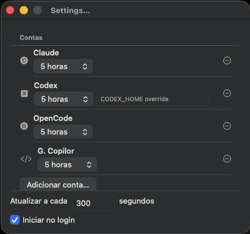

<p align="center">
  
</p>

<h1 align="center">limit-bar</h1>

<p align="center">
  <strong>Los límites de tus suscripciones de IA, en vivo en la barra de menús de macOS.</strong><br>
  Claude Code · Codex · OpenCode · GitHub Copilot — un vistazo, ningún bloqueo sorpresa.
</p>

<p align="center">
  <a href="README.md">English</a> · <a href="README.pt-BR.md">Português (Brasil)</a> · <strong>Español</strong>
</p>

---

## Qué hace

limit-bar permanece en silencio en tu barra de menús mostrando cuánto has consumido de la ventana de uso de tus planes de IA. Haz clic en el icono para abrir un panel compacto con una pestaña por cuenta y una barra de progreso por ventana de límite: porcentajes, valores absolutos cuando el proveedor los informa y cuenta regresiva hasta el próximo reinicio.

| Dónde | Qué ves |
| --- | --- |
| Barra de menús | Una barra en vivo **por cuenta**, con el color de su proveedor (Claude naranja, Codex azul, OpenCode plateado, Copilot morado); al 100 % el % se convierte en cuenta regresiva |
| Panel (clic) | Pestañas por cuenta/plan, barras con el color del proveedor para cada ventana de límite, cuentas regresivas, pie con "actualizado hace…", versión de la app, botón de actualizar y engranaje de Ajustes |

<p align="center">
  <br>
  <em>El icono en vivo: una barra por cuenta con su propio porcentaje.</em>
</p>

<p align="center">
  <br>
  <em>El panel: todas las ventanas de la cuenta seleccionada en una pantalla.</em>
</p>

## Proveedores soportados

| Proveedor | Ventanas monitoreadas | Fuente de datos |
| --- | --- | --- |
| **Claude Code** (Pro/Max/Team) | Sesión de 5 horas · Semanal · cubos semanales por modelo (Fable, Opus, …) | Endpoint OAuth de uso de Anthropic; el token se lee localmente del llavero |
| **Codex** (Plus/Pro) | Primaria ~5 horas · secundaria semanal | `codex app-server` JSON-RPC, con respaldo en `$CODEX_HOME/auth.json` |
| **OpenCode** | Ventana móvil de 5 horas · semanal · mensual | Endpoint oficial de uso de OpenCode Go, autenticado con la clave de API guardada en tu llavero |
| **GitHub Copilot** | Premium requests mensuales | CLI autenticada de Copilot (`account.getQuota` mediante JSON-RPC headless); se omiten las cuotas ilimitadas de chat y completions |

## Instalación

**Requisitos:** macOS 14 (Sonoma) o superior.

1. Descarga `limit-bar-v0.2.0.dmg` (o el `.zip`) de la [última versión](https://github.com/williamfalcom/limit-bar/releases/latest).
2. Ábrelo y arrastra **limit-bar.app** a **Aplicaciones**.
3. Inicia limit-bar — su icono aparece en la barra de menús (sin icono en el Dock a propósito).

<p align="center">
  <br>
  <em>Arrastra limit-bar a Aplicaciones.</em>
</p>

> El build distribuido está firmado ad-hoc. Si Gatekeeper bloquea el primer arranque, haz clic derecho en la app y elige **Abrir**.

## Primer arranque

1. Haz clic en el icono de la barra de menús → el panel abre en estado vacío.
2. Toca el **engranaje** (o *Agrega tu primera cuenta*) para abrir Ajustes.
3. Agrega cuentas:
   - **Claude Code** — nada que escribir. limit-bar lee el token OAuth que tu CLI de Claude Code ya guardó en el llavero (`Claude Code-credentials`). Cuando macOS pregunte, elige **Permitir siempre**.
   - **Codex** — también automático: los límites vienen de `codex app-server`, usando el inicio de sesión que tu CLI ya tiene.
   - **OpenCode** — pega tu clave de API una vez; queda guardada en el llavero y se usa con el endpoint oficial de uso.
   - **GitHub Copilot** — automático cuando la CLI `copilot` está instalada y autenticada (`copilot login`). limit-bar muestra la cuota finita de Premium requests.
4. Las cuentas nuevas se consultan de inmediato; después cada cuenta se actualiza con una cadencia conservadora (por defecto **300 s**, configurable 60–3600 s) con backoff exponencial cuando un proveedor responde `429`.

<p align="center">
  <br>
  <em>Agrega cada proveedor como una cuenta separada en Ajustes.</em>
</p>

### En el día a día

- Las **barras del icono** reflejan todas las cuentas con el color de cada proveedor; seleccionar una pestaña decide qué % aparece junto a ellas.
- **Esc** o hacer clic fuera cierra el panel; el botón ⟳ fuerza una actualización inmediata de todas las cuentas.
- Haz clic derecho en el icono de la barra de menús para actualizar, abrir Ajustes o salir de limit-bar.
- Activa **Iniciar al iniciar sesión** en Ajustes para que el monitoreo sobreviva a los reinicios.
- La interfaz sigue el idioma de macOS (**English**, **Português**, **Español** hoy). También puedes sobrescribirlo por app: Ajustes del Sistema → limit-bar → Idioma.

## Privacidad

Todo permanece en tu máquina. Sin telemetría, sin servicio de cuentas y sin analítica. limit-bar usa las sesiones locales existentes de las CLIs de Claude Code, Codex y GitHub Copilot, guarda tu clave de API de OpenCode en el llavero y consulta endpoints de uso de solo lectura con una cadencia deliberadamente lenta para no perturbar tus cuotas.

## Compilar desde el código fuente

Requisitos: Xcode con `xcodebuild` y [xcodegen](https://github.com/yonaskolb/XcodeGen) (`brew install xcodegen`). Cero dependencias externas.

```bash
scripts/build.sh dev          # Build Debug y lanzamiento
scripts/build.sh prod --dmg   # Release .app + .zip + .dmg en dist/
scripts/build.sh test         # Gate completo de pruebas (Swift Testing)
```

La estructura del proyecto se genera desde `project.yml`; ejecuta `xcodegen generate` tras editarlo. El código vive en `Sources/LimitBar/` (App/Core/Providers/UI) y las pruebas en `Tests/LimitBarTests/`.

## Versionado

Fuente única de verdad: el archivo [`VERSION`](VERSION) (semver). Los builds lo inyectan como versión del bundle; el conteo de commits es el número de build. Las versiones se etiquetan `v<versión>` — actualmente **[v0.2.0](https://github.com/williamfalcom/limit-bar/releases/tag/v0.2.0)**.

## Licencia

limit-bar está licenciado bajo la [GNU Affero General Public License v3.0](LICENSE).

---

<div align="center">
  <sub>Hecho para desarrolladores que usan varios planes de IA al mismo tiempo.</sub><br>
  <sub><a href="README.md">English</a> · <a href="README.pt-BR.md">Português (Brasil)</a> · <strong>Español</strong></sub>
</div>
