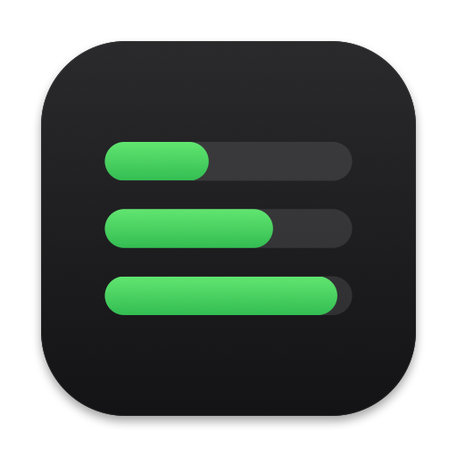
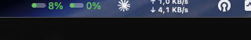
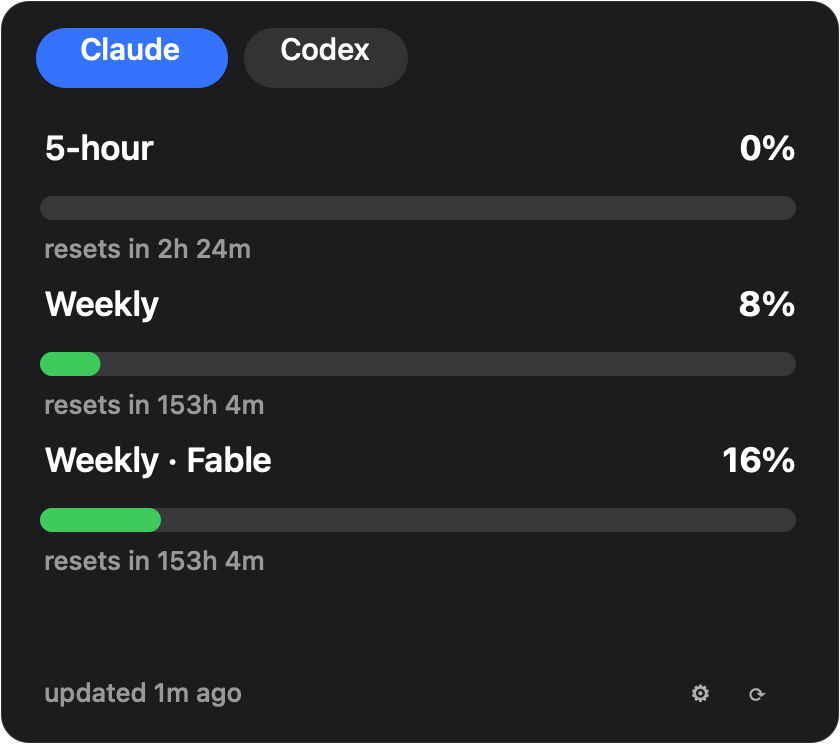
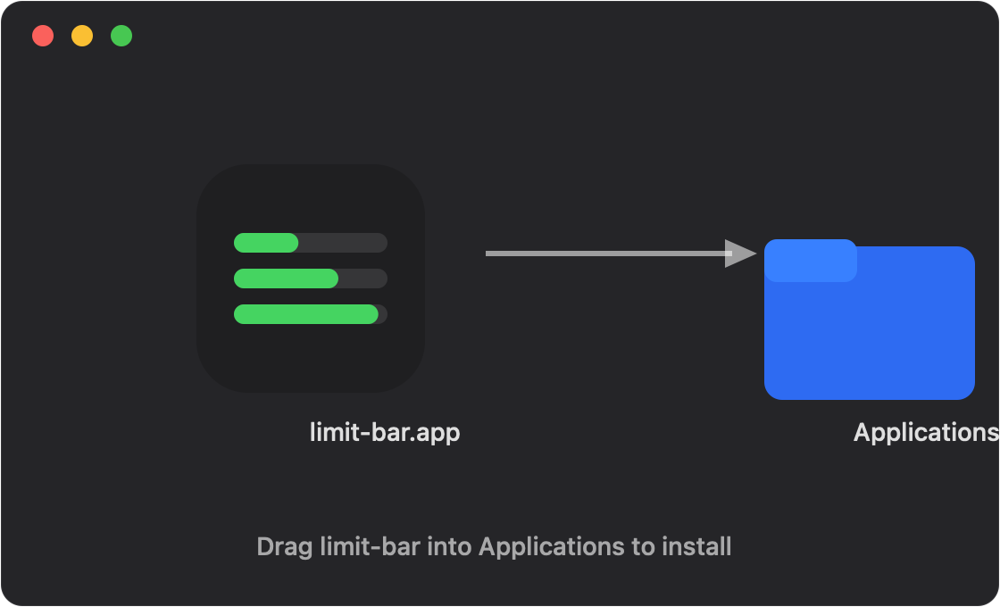

<p align="center">
  
</p>

<h1 align="center">limit-bar</h1>

<p align="center">
  <strong>Os limites das suas assinaturas de IA, ao vivo na barra de menus do macOS.</strong><br>
  Claude Code · Codex · OpenCode Go — uma olhada, nenhum bloqueio surpresa.
</p>

<p align="center">
  <a href="README.md">English</a> · <strong>Português (Brasil)</strong> · <a href="README.es.md">Español</a>
</p>

---

## O que ele faz

O limit-bar fica quieto na sua barra de menus mostrando quanto da janela de uso dos seus planos de IA já foi consumido. Clique no ícone para abrir um painel compacto com uma aba por conta e uma barra de progresso por janela de limite — percentuais, valores absolutos quando o provedor informa e contagem regressiva até a próxima reinicialização.

| Onde | O que você vê |
| --- | --- |
| Barra de menus | Uma barra ao vivo **por conta**, verde (<70%), amarela (70–89%) ou vermelha (≥90%); aos 100% o % vira contagem regressiva |
| Painel (clique) | Abas por conta/plano, uma barra rotulada por janela de limite, rodapé com "atualizado há…", botão de atualizar e engrenagem de ajustes |

<p align="center">
  <br>
  <em>O ícone ao vivo: uma barra por conta com o próprio percentual.</em>
</p>

<p align="center">
  <br>
  <em>O painel: todas as janelas da conta selecionada em uma tela.</em>
</p>

## Provedores suportados

| Provedor | Janelas acompanhadas | Fonte de dados |
| --- | --- | --- |
| **Claude Code** (Pro/Max/Team) | Sessão de 5 horas · Semanal · buckets semanais por modelo (Fable, Opus, …) | Endpoint de uso OAuth da Anthropic, token lido localmente do seu Keychain |
| **Codex** (Plus/Pro) | Primária ~5 horas · secundária semanal | `codex app-server` JSON-RPC, com fallback para `$CODEX_HOME/auth.json` |
| **OpenCode Go** | 5h · semanal · mensal (tetos $12/$30/$60) | Aguardando API pública de uso (issues upstream [#10448](https://github.com/anomalyco/opencode/issues/10448), [#18648](https://github.com/anomalyco/opencode/issues/18648)); a aba mostra um estado explícito de "ainda indisponível" |

## Instalação

**Requisitos:** macOS 14 (Sonoma) ou superior.

1. Baixe `limit-bar-v0.1.0.dmg` (ou o `.zip`) da última release.
2. Abra e arraste o **limit-bar.app** para **Aplicativos**.
3. Inicie o limit-bar — o ícone aparece na barra de menus (sem ícone no Dock, de propósito).

<p align="center">
  <br>
  <em>Arraste o limit-bar para Aplicativos.</em>
</p>

> O build distribuído é assinado ad-hoc. Neste Mac abre direto; em outros, clique direito → **Abrir** na primeira execução para passar pelo Gatekeeper.

## Primeira execução

1. Clique no ícone da barra de menus → o painel abre no estado vazio.
2. Toque na **engrenagem** (ou em *Adicione sua primeira conta*) para abrir os Ajustes.
3. Adicione contas:
   - **Claude Code** — nada para digitar. O limit-bar lê o token OAuth que sua CLI do Claude Code já guardou no Keychain (`Claude Code-credentials`). Quando o macOS perguntar, escolha **Sempre permitir**.
   - **Codex** — também automático: os limites vêm do `codex app-server`, usando o login que sua CLI já tem.
   - **OpenCode Go** — cole sua chave de API uma vez; ela fica guardada no Keychain.
4. Contas novas são consultadas imediatamente; depois cada conta atualiza num ritmo conservador (padrão **300 s**, configurável de 60–3600 s) com backoff exponencial sempre que um provedor responder `429`.

### No dia a dia

- As **barras do ícone** espelham todas as contas; selecionar uma aba decide qual % aparece ao lado delas.
- **Esc** ou clique fora fecha o painel; o botão ⟳ força atualização imediata de todas as contas.
- Ative **Iniciar no login** nos Ajustes para o monitoramento sobreviver às reinicializações.
- A interface segue o idioma do macOS (**English**, **Português**, **Español** hoje). Sobrescrever por app também funciona: Ajustes do Sistema → limit-bar → Idioma.

## Privacidade

Tudo fica na sua máquina. Sem telemetria, sem serviço de contas, sem analytics. O limit-bar conversa apenas com os provedores configurados, reutilizando as credenciais que as próprias CLIs guardam localmente, e consulta endpoints de uso somente-leitura num ritmo propositalmente lento para nunca atrapalhar suas cotas.

## Compilar do código-fonte

Requisitos: Xcode com `xcodebuild` e [xcodegen](https://github.com/yonaskolb/XcodeGen) (`brew install xcodegen`). Zero dependências externas.

```bash
scripts/build.sh dev          # Build Debug e inicialização
scripts/build.sh prod --dmg   # Release .app + .zip + .dmg em dist/
scripts/build.sh test         # Gate completo de testes (Swift Testing)
```

A estrutura do projeto é gerada a partir do `project.yml`; rode `xcodegen generate` após editá-lo. O código fica em `Sources/LimitBar/` (App/Core/Providers/UI) e os testes em `Tests/LimitBarTests/`.

## Versionamento

Fonte única de verdade: o arquivo [`VERSION`](VERSION) (semver). Os builds injetam essa versão no bundle; a contagem de commits vira o número de build. Releases são taggeadas `v<versão>` — atualmente **v0.1.0**.

---

<div align="center">
  <sub>Feito para desenvolvedores que malham em vários planos de IA ao mesmo tempo.</sub><br>
  <sub><a href="README.md">English</a> · <strong>Português (Brasil)</strong> · <a href="README.es.md">Español</a></sub>
</div>
